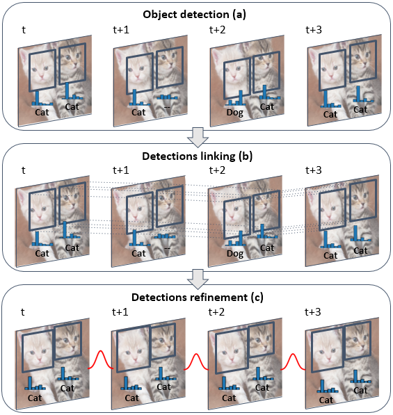

# Robust and efficient post-processing for Video Object Detection (REPP)

[](https://paperswithcode.com/sota/video-object-detection-on-imagenet-vid?p=robust-and-efficient-post-processing-for)

[[Paper](https://arxiv.org/abs/2009.11050)]

__REPP__ is a learning based post-processing method to improve video object detections from any object detector. REPP links detections accross frames by evaluating their similarity and refines their classification and location to suppress false positives and recover misdetections.

<p align="center"></p>

REPP improves video detections both for specific Image and Video Object Detectors and it supposes a light computation overhead.

<p align="center"></p>


## Installation

REPP has been tested with Python 3.6.

Its dependencies can be found in _repp_requirements.txt_ file.

```pip install -r repp_requirements.txt```


## Quick usage guide

Video detections must be stored with pickle as tuples (video_name, {frame_dets}) as following:

```
("video_name", {"000001": [ det_1, det_2, ..., det_N ],
                "000002": [ det_1, det_2, ..., det_M ]},
                ...)
```

If the stored predictions file contains detections for different videos, they must be saved as a stream of tuples with the above format.

And each detection must have the following format:

```
det_1: {'image_id': image_id,     # Same as the used in ILSVRC if applies
        'bbox': [ x_min, y_min, width, height ],
        'scores': scores,         # Vector of class confidence scores
        'bbox_center': (x,y) }    # Relative bounding box center
```

_bbox_center_ coordinates are bounded by 0 and 1 and referes to the center of the detection when the image has been padded vertically or horizontally to fit a square shape. 

Check [this code](https://github.com/AlbertoSabater/Robust-and-efficient-post-processing-for-video-object-detection/blob/master/demos/YOLOv3/get_repp_predictions.py) for a better insight about the predictions format.

Post-processed detections can be saved both with the COCO or IMDB format.


```
python REPP.py --repp_cfg ./REPP_cfg/cfg.json --predictions_file predictions_file.pckl --store_coco --store_imdb
```

As a REPP configuration file, you can use either _fgfa_repp_cfg.json_ or _yolo_repp_cfg.json_. The first one works better with high performing detectors such as SELSA or FGFA and the second one works better for lower quality detectors. We recommend to set _appearance_matching_ to false in the config file since it requires a non-trivial training of extra models and it's not mandatory for the performance bossting. If needed, the following config parameters can be tunned:

* _min_tubelet_score_ and _min_pred_score_: threshold used to suppress low-scoring detections. Higher values speeds up the post-processing execution.
* _clf_thr_: threshold to suppress low-scoring detections linking. Lower values will lead to more False Positives and higher ones will lead to fewer detections.
* _recoordinate_std_: higher values lead to a more aggressive recoordinating, lower values to a smoother one.

Below you will find instructions to perform any video predictions with YOLOv3 and apply REPP.


## Demos

In order to reproduce the results of the paper, you can download the predictions of the different models from the following [link](https://drive.google.com/file/d/11SW3vqJthMtvW7tusVLgqNvRVgW4R90x/view?usp=sharing) and locate them in the project folder as structured in the downloaded zip folder. 

Imagenet VID dataset must be downloaded and stored with the following folder structure:
```
/path/to/dataset/ILSVRC2015/
/path/to/dataset/ILSVRC2015/Annotations/DET
/path/to/dataset/ILSVRC2015/Annotations/VID
/path/to/dataset/ILSVRC2015/Data/DET
/path/to/dataset/ILSVRC2015/Data/VID
/path/to/dataset/ILSVRC2015/ImageSets
```

Following commands will apply the REPP post-processing and will evaluate the results by calculating the mean Average Precision for different object motions:

```
# YOLO
python REPP.py --repp_cfg ./REPP_cfg/yolo_repp_cfg.json --predictions_file './demos/YOLOv3/predictions/base_preds.pckl' --evaluate --annotations_filename ./data_annotations/annotations_val_ILSVRC.txt  --path_dataset /path/to/dataset/ILSVRC2015/ --store_coco --store_imdb
> {'mAP_total': 0.7506216640807263, 'mAP_slow': 0.825347229618856, 'mAP_medium': 0.742908326433008, 'mAP_fast': 0.5657881762511975}

# FGFA
python REPP.py --repp_cfg ./REPP_cfg/fgfa_repp_cfg.json --predictions_file './demos/Flow-Guided-Feature-Aggregation/predictions/base_preds.pckl' --evaluate --annotations_filename ./data_annotations/annotations_val_ILSVRC.txt --path_dataset /path/to/dataset/ILSVRC2015/ --store_coco --store_imdb
> {'mAP_total': 0.8009014265948871, 'mAP_slow': 0.8741923949671497, 'mAP_medium': 0.7909183123072739, 'mAP_fast': 0.6137783055850773}

# SELSA
python REPP.py --repp_cfg ./REPP_cfg/selsa_repp_cfg.json --predictions_file './demos/Sequence-Level-Semantics-Aggregation/predictions/old_preds.pckl' --evaluate --annotations_filename ./data_annotations/annotations_val_ILSVRC.txt --path_dataset /path/to/dataset/ILSVRC2015/ --store_coco --store_imdb
> {'mAP_total': 0.8421329795837483, 'mAP_slow': 0.8871784038276325, 'mAP_medium': 0.8332090469178383, 'mAP_fast': 0.7109387713303483}
```

Instead of download the base predictions, you can also compute them. To do so, you must __install the proper dependencies__ for each model as specified in the original model repositories ([YOLOv3](https://github.com/AlbertoSabater/Robust-and-efficient-post-processing-for-video-object-detection/tree/master/demos/YOLOv3), [FGFA](https://github.com/guanfuchen/Flow-Guided-Feature-Aggregation), [SELSA](https://github.com/happywu/Sequence-Level-Semantics-Aggregation)). You must also download their weights and config files from the following [link](https://drive.google.com/file/d/19aRWqMytRRq3ukV5h3lNAghIgs4JCpbz/view?usp=sharing) and locate them in the project folder as structured in the downloaded zip file. Then execute the following commands:

```
# YOLO
cd demos/YOLOv3/
python get_repp_predictions.py --yolo_path ./pretrained_models/ILSVRC/1203_1758_model_8/ --repp_format --add_appearance --from_annotations ../../data_annotations/annotations_val_ILSVRC.txt --dataset_path /path/to/dataset/ILSVRC2015/Data/VID/

# FGFA
cd demos/Flow-Guided-Feature-Aggregation/fgfa_rfcn/
python get_repp_predictions.py  --det_path 'path_to_dataset/ILSVRC2015/'
# SELSA

cd demos/Sequence-Level-Semantics-Aggregation/
python experiments/selsa/get_repp_predictions.py --dataset_path 'path_to_dataset/ILSVRC2015/'
```


## REPP applied to custom videos

REPP can be also applied to the predictions from any video as long as they have the specified REPP format. Following code shows how to compute YOLO predictions from any video and apply REPP post-processing.
```
# Extract YOLOv3 predictions
cd demos/YOLOv3/
python get_repp_predictions.py --yolo_path ./pretrained_models/ILSVRC/1203_1758_model_8/ --repp_format --add_appearance --from_video ./test_images/video_1.mp4

# Apply REPP
cd ../..
python REPP.py --repp_cfg ./REPP_cfg/yolo_repp_cfg.json --predictions_file './demos/YOLOv3/predictions/preds_repp_app_video_1.pckl' --store_coco
```


## REPP matching model training on ILSVRC

The present project includes trained linking models both to perform the detection matching with and without appearance descriptors. These models have been trained with data from Imagenet VID, but they are able to improve detections for any other dataset or custom video. These Logistic Regression models have been trained using the following steps, that can be adapted to any other custom dataset:

1. Generate annotations for the Logistic Regression training, based on triplet tuplets (Anchor, Positive, Negative):
```
python create_triplet_ilsvrc_annotations.py --path_dataset '/path/to/dataset/ILSVRC2015/'
```
2. Generate matching features from the annotations:
```
python clf_dataset_generation.py --path_dataset '/path/to/dataset/ILSVRC2015/' --add_appearance
```
3. Train and store the Logistic Regression model:
```
python train_clf_model.py --add_appearance
```

Previous steps include appearance features calculated from a pretrained YOLOv3 model. If you are going to use a different dataset or detection model, it's recommended to omit the _--add_appearance_ parameter.


## Citation
```
@inproceedings{sabater2020repp,
  title={Robust and efficient post-processing for Video Object Detection},
  author={Alberto Sabater, Luis Montesano, Ana C. Murillo},
  booktitle={International Conference of Intelligent Robots and Systems (IROS)},
  year={2020}
}
```

